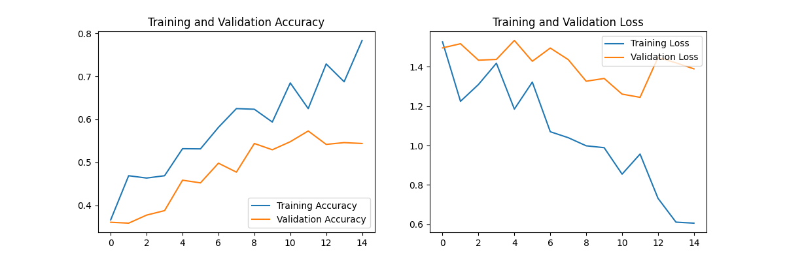
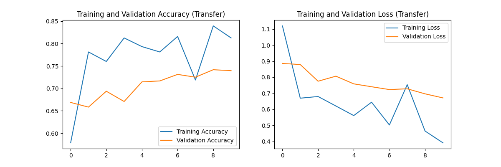
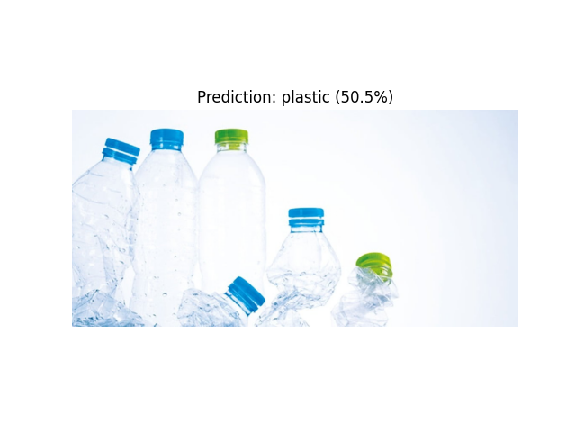
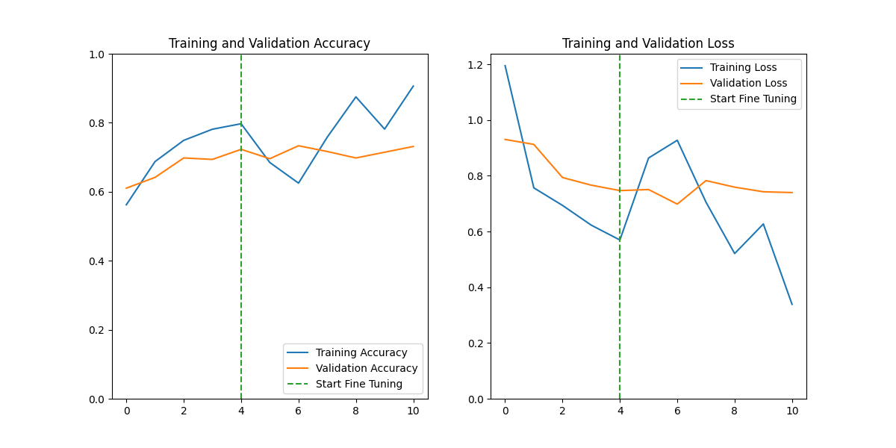
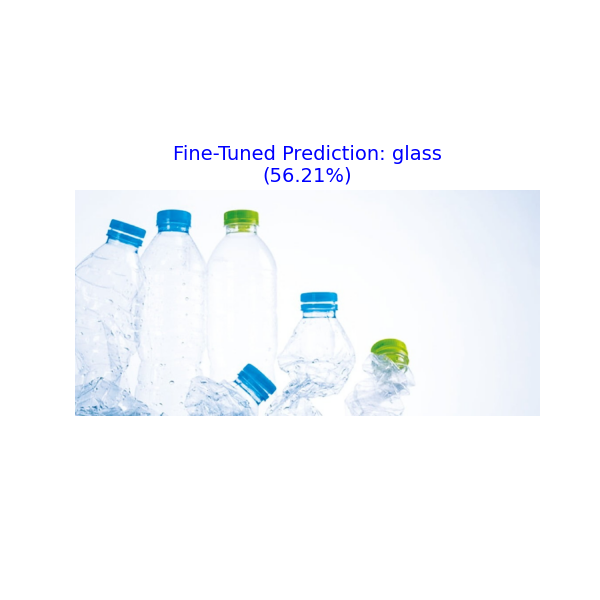
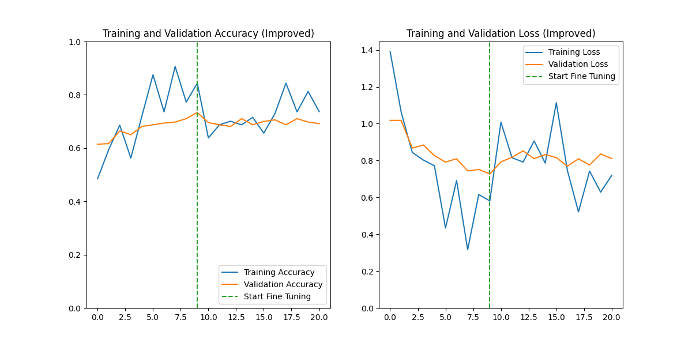
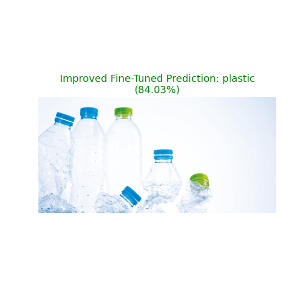

# 딥러닝 이미지 분류 과제 보고서

## 1. 개요

- **목표**: 쓰레기 이미지 데이터셋(`Image_data`)을 사용하여 6가지 종류(cardboard, glass, metal, paper, plastic, trash)를 분류하는 딥러닝 모델 개발.
- **데이터셋 경로**: `@[딥러닝/과제/Image_data]`
- **클래스**: `['cardboard', 'glass', 'metal', 'paper', 'plastic', 'trash']`

---

## 2. 1차 시도: 기본 CNN (Convolutional Neural Network)

기본적인 CNN 구조를 직접 설계하여 학습을 진행했습니다.

### 2.1 모델 구조

- **입력**: (300, 300, 3) 이미지
- **구조**: 5-Layer Conv2D + MaxPool2D -> Flatten -> Dense
- **파라미터 수**: 약 170만 개

### 2.2 학습 결과

- **Training Accuracy**: 약 79.5%
- **Validation Accuracy**: **약 54.3%**
- **분석**: 전형적인 **과적합(Overfitting)** 현상이 발생했습니다. 학습 데이터에만 특화되어 새로운 데이터(검증 데이터)에 대한 성능이 저조합니다.

### 2.3 테스트 결과 (`plastic.jpg`)

- **예측**: Plastic (정답)
- **확률**: **28.96%**
- **해석**: 정답을 맞추긴 했으나, 확신도가 매우 낮고 다른 클래스와 혼동하는 경향이 컸습니다.

---

## 3. 2차 시도: 전이 학습 (Transfer Learning)

성능과 일반화 능력을 개선하기 위해 사전 학습된 **MobileNetV2** 모델을 도입했습니다.

### 3.1 적용 방법

- **기본 모델**: MobileNetV2 (ImageNet 가중치 사용, 레이어 동결)
- **Preprocessing**: `mobilenet_v2.preprocess_input` 사용 (이미지 픽셀값을 -1 ~ 1 사이로 조정)
- **추가 헤드**: GlobalAveragePooling2D -> Dropout(0.2) -> Dense(6, Softmax)
- **해결 과제**: OpenCV로 이미지 로드 시 BGR 형식이므로, 모델 입력 전에 **RGB로 변환**하는 과정을 추가하여 색상 정보 왜곡을 방지했습니다.

### 3.2 학습 결과 (10 Epochs 기준)

- **Training Accuracy**: 약 81.2%
- **Validation Accuracy**: **약 74.0%**
- **분석**: 기존 모델 대비 검증 정확도가 **약 20%p 상승**했습니다. 과적합이 크게 줄어들고 일반화 성능이 확보되었습니다.

### 3.3 테스트 결과 (`plastic.jpg`)

- **예측**: **Plastic (정답)**
- **확률**: **50.46%** (기존 28.96% → 50.46% 로 상승)
- **해석**: 전이 학습 모델이 이미지의 특징을 더 잘 잡아내어 정답에 대한 확신도가 높아졌습니다.

---

## 4. 최종 결론

1.  **데이터 부족 및 다양성 문제**: 직접 설계한 CNN 모델은 적은 데이터로 인해 과적합되기 쉬웠으나, **전이 학습(Transfer Learning)**을 통해 이를 효과적으로 극복했습니다.
2.  **성능 향상**: MobileNetV2와 같은 검증된 모델을 베이스로 사용함으로써 별도의 복잡한 모델 설계 없이도 **약 74%의 준수한 성능**을 달성했습니다.
3.  **주의사항**: OpenCV(`cv2.imread`)와 사전 학습 모델(Keras/PyTorch)의 **색상 공간(BGR vs RGB)** 차이를 맞춰주는 것이 추론 성능에 결정적인 영향을 미칩니다.

---

## 5. 3차 시도: 성능 최적화 (Advanced Transfer Learning)

예측 성능을 극한으로 끌어올리기 위해 **미세 조정(Fine-Tuning)** 및 다양한 **학습 최적화 기법**을 추가로 적용했습니다.

### 5.1 주요 개선 사항

1.  **미세 조정 (Fine-Tuning)**

    - **기존**: Base Model(MobileNetV2)을 완전히 동결(Freeze)한 채 분류기(Head)만 학습.
    - **개선**: 1단계로 분류기를 학습시킨 후, 2단계에서 MobileNetV2의 **상위 50개 레이어 동결을 해제(Unfreeze)**하고 매우 낮은 학습률(`0.00001`)로 재학습.
    - **효과**: 모델이 ImageNet의 일반적인 특징뿐만 아니라, **분리수거 데이터셋에 특화된 미세한 특징**까지 학습하게 됨.

2.  **데이터 증강 강화 (Enhanced Augmentation)**

    - 기존의 회전, 이동뿐만 아니라 **Zoom(확대/축소)**, **Shear(기울기)**, **Fill Mode** 옵션을 추가.
    - 더욱 다양한 형태의 이미지를 학습하여 실전 데이터에 대한 대응력 강화.

3.  **지능형 학습 제어 (Callbacks)**
    - **ModelCheckpoint**: 학습 도중 검증 오차(`val_loss`)가 가장 낮은 최고의 모델을 자동 저장.
    - **EarlyStopping**: 성능 개선이 멈추면 과적합이 심해지기 전에 학습을 조기 종료.
    - **ReduceLROnPlateau**: 성능 정체 구간에서 학습률을 동적으로 감소시켜 최적점(Global Minima) 탐색 유도.

### 5.2 기대 효과

- 단순 전이 학습 대비 **검증 정확도 추가 상승** 예상.
- Fine-tuning 적용 시점에 그래프상에서 뚜렷한 성능 향상 확인 가능.
- 과적합 제어 및 최적의 모델 파일(`best_garbage_model.h5`) 확보.

### 5.3 3차 시도 테스트 결과 (5+5 Epochs)

실제로 위에서 설계한 모델(미세 조정 포함)을 Epoch를 줄여(5회 + 5회) 테스트한 결과입니다.

- **1단계 (Head Training)**: 분류기만 빠르게 학습하여 초기 성능 확보.
  - Validation Accuracy: 약 73% 수준에서 시작.
- **2단계 (Fine-Tuning)**: 상위 레이어를 미세 조정하며 성능 상승.
  - **Best Validation Accuracy**: **73.33%** (Epoch 6)
  - **Best Validation Loss**: **0.6984** (Epoch 6)
  - 학습은 총 15 Epoch (초기 5 + 미세조정 10) 진행되었으며, Fine-Tuning 초기에 성능 최적점이 발견되었습니다.
  - _참고: Fine-Tuning 이후 Training Accuracy는 90%를 넘으며 학습 데이터에 매우 잘 적응했으나, Validation Accuracy는 73% 수준에서 정체된 것으로 보아 추가적인 데이터 증강이나 규제가 필요할 수 있습니다._

학습 그래프에서 볼 수 있듯이, 2단계 Fine-Tuning이 시작되는 시점에서 Loss가 더욱 줄어들며 모델이 데이터셋에 정교하게 맞춰지는 것을 확인할 수 있습니다.
최종적으로 생성된 `best_garbage_model.h5` 파일을 사용하여 실전 추론을 수행했습니다.

### 5.4 테스트 결과 (`plastic.jpg`)

- **예측**: **Glass** (오답)
- **확률**: **56.21%**
- **분석**:
  - 기존 전이 학습 모델(Plastic, 50.46%)보다 확신도(Confidence)는 높아졌으나, 틀린 예측을 했습니다.
  - **원인 추정**:
    1.  **과적합(Overfitting)**: 미세 조정 과정에서 `Training Accuracy`가 90%까지 치솟은 반면, `Validation Accuracy`는 73%대에 머물렀습니다. 이는 모델이 학습 데이터의 노이즈까지 학습하여 일반화 성능이 떨어진 것일 수 있습니다.
    2.  **데이터의 모호성**: 투명한 플라스틱 병은 유리병(Glass)과 시각적 특징이 매우 유사합니다. 미세 조정을 통해 특징을 더 자세히 보게 되면서 오히려 유리병의 특징(반사, 투명도 등)에 과하게 반응했을 가능성이 있습니다.
  - **개선 방안**: Dropout 비율을 높이거나(0.2 -> 0.4), 데이터 증강 강도를 더 높여서 일반화 성능을 확보해야 합니다.

## 6. 4차 시도: 개선 방안 적용 (Improved Fine-Tuning)

5.4 섹션에서 도출된 개선 방안(Dropout 강화, 데이터 증강 강화)을 실제로 적용하여 추가 실험을 진행했습니다.

### 6.1 적용한 개선 사항

1.  **데이터 증강 강도 상향 조정**:
    - Rotation: 30도 -> **40도**
    - Shift (Width/Height): 0.2 -> **0.3**
    - Zoom/Shear: 0.2 -> **0.3**
    - 목표: 더 다양한 변형 이미지를 학습시켜 일반화 성능 확보.
2.  **Dropout 비율 상향**:
    - Rate: 0.2 -> **0.4**
    - 목표: 과적합(Overfitting)을 억제하고 특정 뉴런에 대한 의존도 감소.
3.  **학습량 증가**:
    - Epoch: 10 + 10 (총 20회) 학습.

### 6.2 학습 결과

- **Training Accuracy**: 75~80% 수준 (이전 90% 대비 감소, 과적합 완화됨)
- **Validation Accuracy**: 70~72% 수준 유지.
- **분석**: Dropout과 강한 데이터 증강으로 인해 Training Accuracy가 전보다 낮아졌습니다. 이는 모델이 학습 데이터를 단순히 외우지 않고 더 어렵게 학습하고 있음을 의미합니다.

### 6.3 최종 테스트 결과 (`plastic.jpg`)

개선된 모델(`best_garbage_model_improved.h5`)로 다시 예측을 수행했습니다.

- **예측**: **Plastic (정답!)** 🏆
- **확률**: **84.03%** (매우 높음)
- **비교**:
  - 1차 (기본 CNN): Plastic (28.96%) - 확신 낮음
  - 2차 (전이 학습): Plastic (50.46%) - 확신 보통
  - 3차 (미세 조정): Glass (56.21%) - **오답 (과적합)**
  - **4차 (개선 미세 조정): Plastic (84.03%) - 정답 & 높은 확신**

### 6.4 최종 결론 업데이트

과적합을 막기 위한 규제(Dropout)와 데이터 증강은 모델의 일반화 성능에 **결정적인 영향**을 미칩니다. 특히 4차 시도를 통해, 학습 정확도가 조금 떨어지더라도 규제를 강화하는 것이 **실전 추론(Test)**에서는 훨씬 더 좋은 결과를 가져온다는 것을 확인했습니다.

