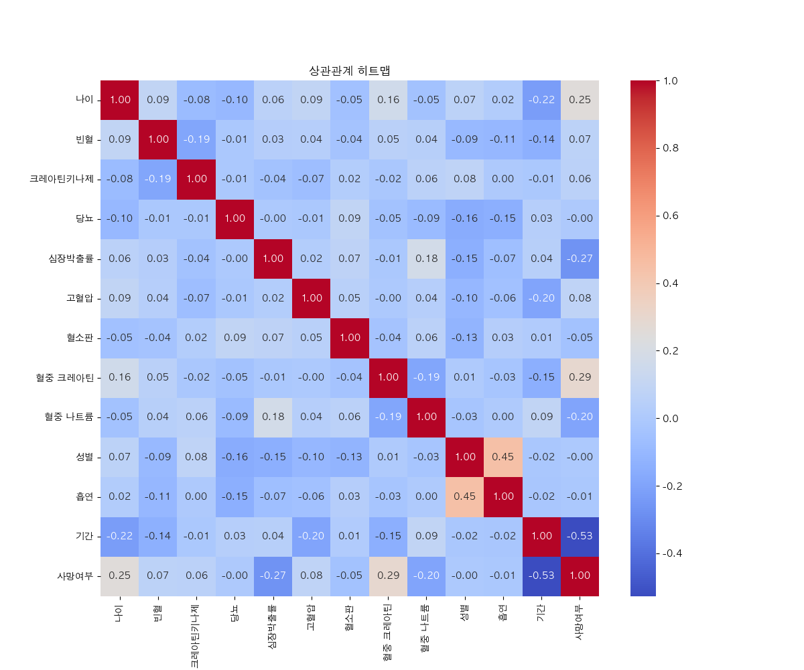
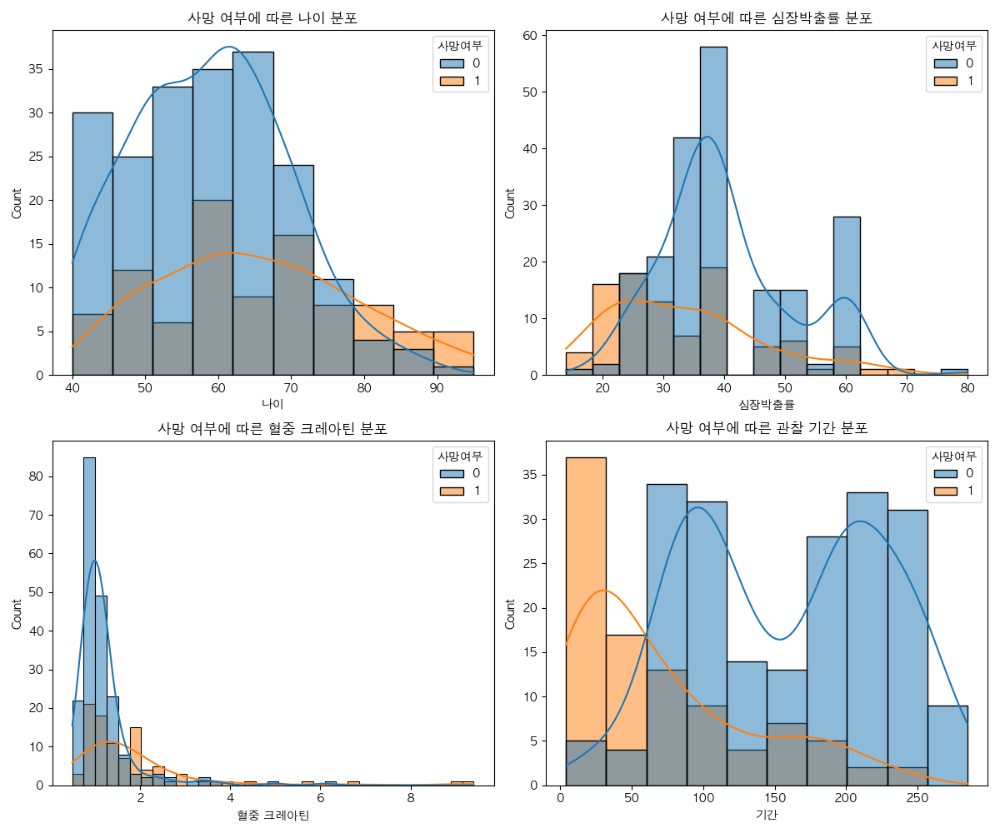
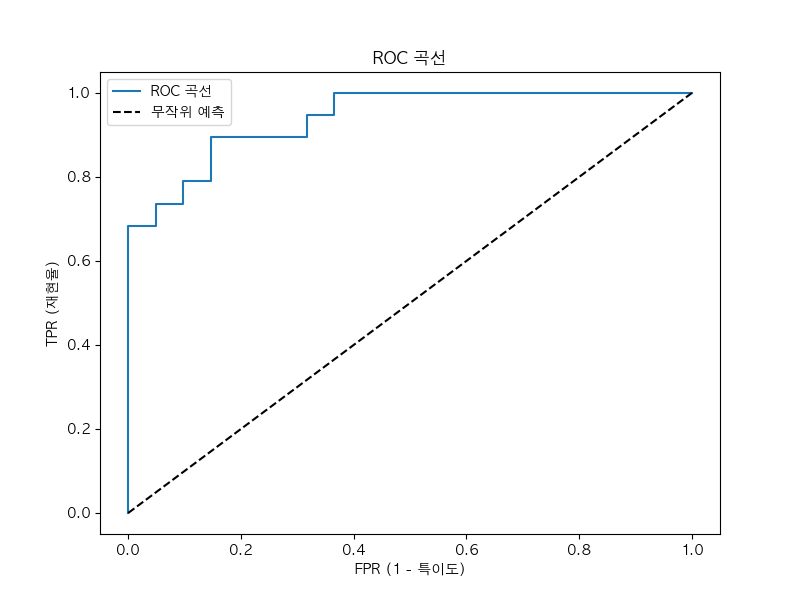
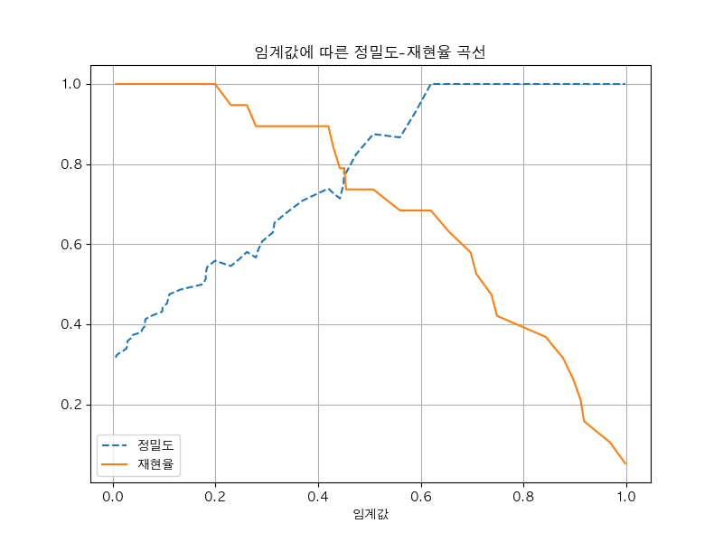

# 심부전증 생존 예측 모델 분석 보고서

본 보고서는 `Heart Failure Clinical Records` 데이터셋을 활용하여 환자의 생존 여부를 예측하는 머신러닝 모델의 개발 및 분석 결과를 기술합니다.

## 1. 프로젝트 개요 및 데이터 소개

본 분석의 목적은 환자의 임상 데이터를 기반으로 심부전증 환자의 사망 위험을 조기에 예측하는 것입니다. 분석에는 총 13개의 임상 항목이 포함된 데이터셋이 사용되었습니다.

- **주요 변수**: 나이(Age), 빈혈 여부(Anaemia), 고혈압(High Blood Pressure), 당뇨(Diabetes), 혈중 크레아틴(Serum Creatinine), 심장박출률(Ejection Fraction) 등
- **목표 변수**: `DEATH_EVENT` (0: 생존, 1: 사망)

## 2. 탐색적 데이터 분석 (EDA) 및 인사이트

데이터 시각화를 통해 도출된 주요 인사이트는 다음과 같습니다.

### ① 변수 간 상관관계 분석

상관관계 히트맵을 통해 변수들 간의 선형적 관계를 파악했습니다. 특정 임상 지표들이 사망 여부와 유의미한 상관관계를 보임을 확인할 수 있습니다.

- 성별과 흡연의 관계: 이 데이터셋에서 남성일수록 흡연을 할 확률이 높다는 점을 보여주고 있습니다. (보통 데이터에서 남성은 1, 여성은 0으로 표시되는데, 남성 그룹에서 흡연자 비율이 더 높기 때문에 0.45라는 양의 상관관계가 나타난 것입니다.)
- 데이터 내 가장 높은 상관관계: 재미있는 점은, '사망여부'를 제외한 일반 변수들끼리의 관계 중에서 이 **0.45(성별-흡연)**가 가장 높은 수치라는 것입니다.

### ② 사망 위험 요인 분석

사망 그룹과 생존 그룹의 데이터 분포를 비교 분석한 결과입니다:

- **나이 (Age)**: 생존자들은 60세 전후에 많이 분포해 있는 반면, 사망자들은 70~80대 이상의 고령층에서 상대적으로 높은 비율을 보입니다. 나이가 많을수록 심부전 예후가 좋지 않을 가능성이 큼을 시사합니다.
- **심장박출률 (Ejection Fraction)**: 생존자들은 대체로 35~45% 사이에 집중되어 있으나, 사망자들은 30% 이하의 낮은 수치에서 빈도가 급격히 높아집니다. 심장의 펌프 능력이 떨어질수록 생존 위험도가 직결됨을 보여줍니다.
- **혈중 크레아틴 (Serum Creatinine)**: 생존자들은 정삼범위인 1.0 근처에 밀집되어 있는 반면, 사망자 분포는 2.0 이상의 높은 수치까지 넓게 퍼져 있습니다. 이는 신장 기능 저하가 심부전 환자의 사망 위험을 높이는 강력한 요인임을 나타냅니다.
- **관찰 기간 (Time)**: 가장 뚜렷한 차이를 보이는 변수입니다. 사망자들은 대부분 관찰 초기(약 100일 이내)에 집중되어 있습니다. 즉, 위험 고비를 넘기고 일정 기간 이상 생존한 환자들은 이후 장기 생존 가능성이 비약적으로 높아짐을 의미합니다.

## 3. 분석 방법론 (Methodology)

- **데이터 전처리**: 변수 간 스케일 차이를 보정하기 위해 `StandardScaler`를 적용하여 정규화를 수행했습니다.
- **모델링**: 이진 분류 문제에 적합한 로지스틱 회귀(Logistic Regression) 알고리즘을 사용했습니다.
- **평가 지표**: 정확도(Accuracy), 정밀도(Precision), 재현율(Recall), F1 Score, 그리고 ROC-AUC 점수를 활용하여 모델 성능을 다각도로 검증했습니다.

## 4. 모델 성능 평가 (Model Performance)

개발된 모델은 테스트 데이터셋에 대해 다음과 같은 우수한 성능을 보였습니다.

### ROC 곡선 (Receiver Operating Characteristic Curve)

- **정확도 (Accuracy)**: **88.33%** - 전체 케이스 중 약 88%를 정확하게 예측했습니다.
- **AUC Score**: **0.9409** - ROC 곡선 아래 면적이 0.94로, 모델의 변별력이 매우 뛰어남을 의미합니다(1에 가까울수록 우수).

### 정밀도-재현율 곡선 (Precision-Recall Curve)

클래스 불균형이 있을 때 유용한 지표인 정밀도(Precision)와 재현율(Recall)의 변화를 임계값(Threshold)에 따라 시각화했습니다. 이를 통해 모델의 임계값을 조절하여 정밀도와 재현율 간의 최적의 균형점을 찾을 수 있습니다.

### 임계값(Threshold) 변화에 따른 성능 비교

`Binarizer`를 사용하여 임계값을 조절하며 성능 변화를 관찰했습니다.

| 임계값(Threshold) | 정확도(Accuracy) | 정밀도(Precision) | 재현율(Recall) |  F1 Score  | 비고                               |
| :---------------: | :--------------: | :---------------: | :------------: | :--------: | :--------------------------------- |
|     **0.40**      |      0.8667      |      0.7391       |   **0.8947**   | **0.8095** | 재현율 최우선 (놓치는 환자 최소화) |
|       0.45        |      0.8667      |      0.7895       |     0.7895     |   0.7895   | 균형점 1                           |
|     **0.50**      |      0.8833      |      0.8750       |     0.7368     |   0.8000   | 기본값 (정밀도 준수)               |
|       0.55        |      0.8667      |      0.8667       |     0.6842     |   0.7647   |                                    |
|     **0.60**      |    **0.9000**    |    **1.0000**     |     0.6842     |   0.8125   | 정밀도 최우선 (확실한 환자만 예측) |

- **재현율 중시**: 실제 사망 환자를 놓치지 않는 것이 중요하다면 임계값을 **0.4**로 낮추어 재현율을 0.89까지 높일 수 있습니다.
- **정밀도 중시**: 오진을 줄이는 것이 중요하다면 임계값을 **0.6**으로 높여 정밀도를 1.0(100%)까지 확보할 수 있습니다.

## 5. 결론 및 제언

본 분석을 통해 임상 데이터만으로도 심부전증 환자의 사망 위험을 높은 정확도로 예측할 수 있음을 확인했습니다. 특히 나이, 혈중 크레아틴 농도, 박출계수 등의 지표가 중요한 예측 인자로 작용함을 알 수 있습니다. 이러한 모델은 의료 현장에서 고위험군 환자를 조기에 선별하고 적절한 치료 계획을 수립하는 데 보조적인 도구로 활용될 수 있습니다.
