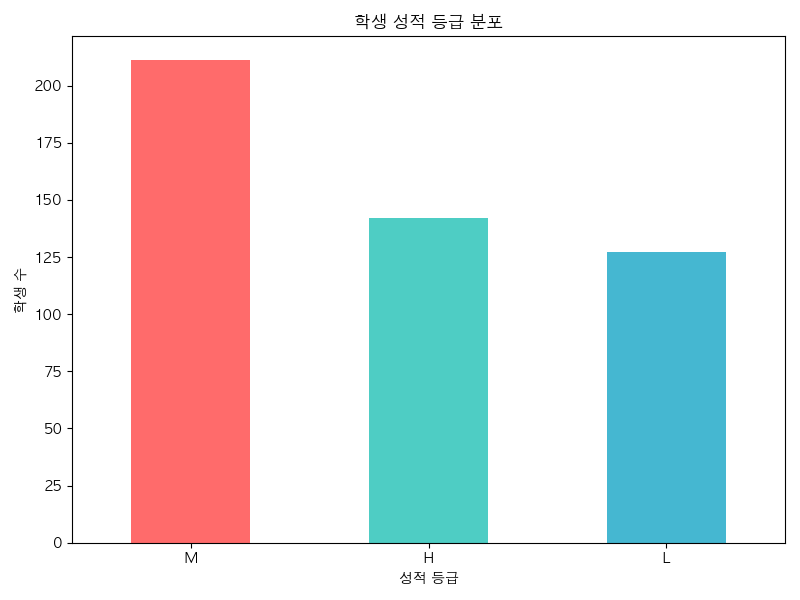
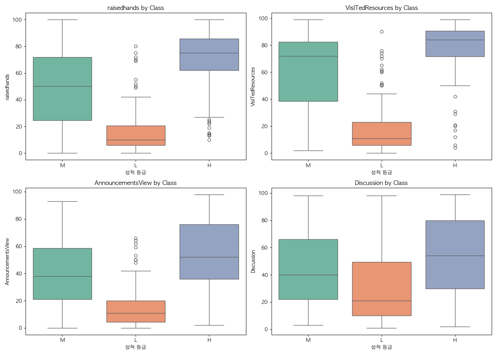
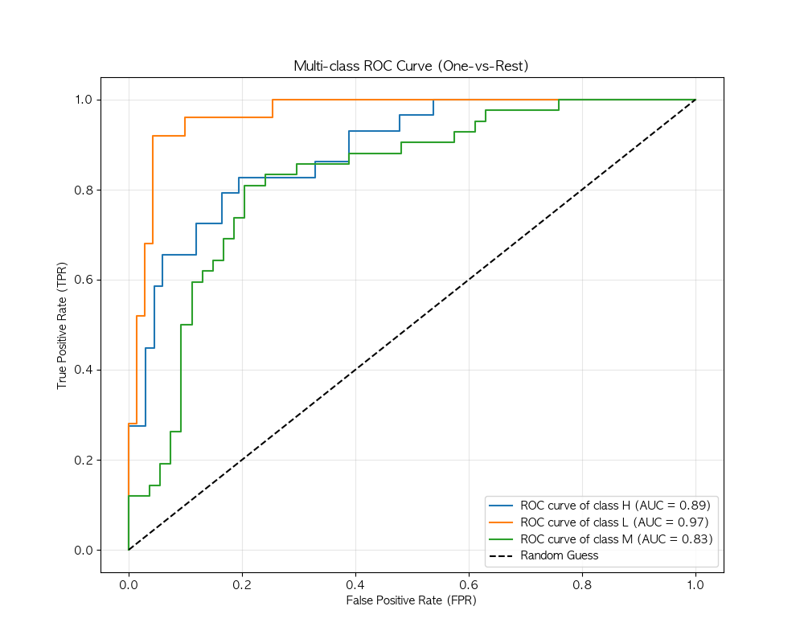
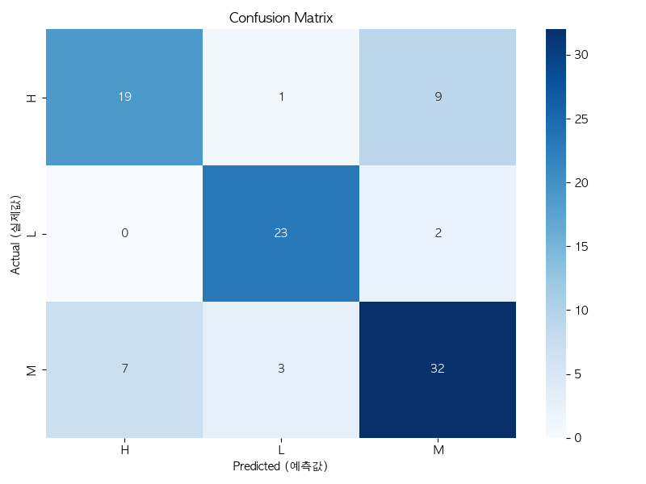
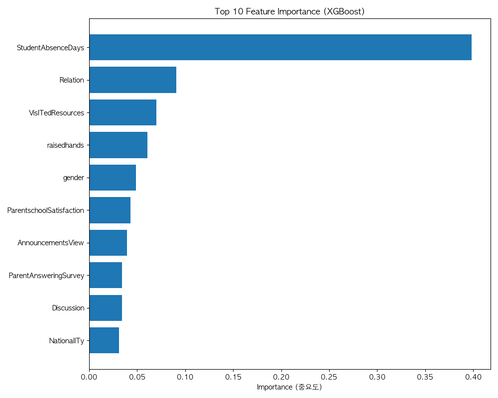

# 학생 성적 예측 분석 보고서

## 1. 프로젝트 개요

본 분석은 xAPI-Edu-Data 데이터셋을 활용하여 학생의 학습 성과를 예측하는 머신러닝 모델을 구축하는 것을 목표로 합니다.

- **분석 목적**: 학생의 행동 패턴과 배경 정보를 기반으로 성적 등급(Low/Medium/High) 예측
- **사용 모델**: XGBoost Classifier
- **주요 기법**: 탐색적 데이터 분석(EDA), Label Encoding, 분류 모델링

---

## 2. 데이터 개요

### 2.1 데이터 구조

- **총 샘플 수**: 480개
- **총 변수 수**: 17개 (피처 16개 + 타겟 1개)
- **결측치**: 없음

### 2.2 변수 설명

#### 범주형 변수 (12개)

- `gender`: 학생의 성별 (M: 남성, F: 여성)
- `NationalITy`: 학생의 국적
- `PlaceofBirth`: 학생이 태어난 국가
- `StageID`: 학생이 다니는 학교 단계 (초등/중등/고등)
- `GradeID`: 학생이 속한 성적 등급
- `SectionID`: 학생이 속한 반
- `Topic`: 수강한 과목
- `Semester`: 수강한 학기 (1학기/2학기)
- `Relation`: 주 보호자와 학생의 관계
- `ParentAnsweringSurvey`: 부모의 설문 참여 여부
- `ParentschoolSatisfaction`: 부모의 학교 만족도
- `StudentAbsenceDays`: 학생의 결석 횟수 (7회 이상/미만)

#### 수치형 변수 (4개)

- `raisedhands`: 수업 중 손을 든 횟수 (평균: 46.8회)
- `VisITedResources`: 과목 공지 확인 횟수 (평균: 54.8회)
- `AnnouncementsView`: 공지사항 조회 횟수 (평균: 37.9회)
- `Discussion`: 토론 그룹 참여 횟수 (평균: 43.3회)

#### 타겟 변수

- `Class`: 학생의 성적 등급
  - **H (High)**: 142명 (29.6%)
  - **M (Medium)**: 211명 (44.0%)
  - **L (Low)**: 127명 (26.5%)

### 2.3 타겟 변수 분포

클래스 분포가 비교적 균형적이며, Medium 등급이 가장 많고 Low 등급이 가장 적습니다.

---

## 3. 탐색적 데이터 분석 (EDA)

### 3.1 수치형 변수와 성적의 관계

**주요 인사이트:**

- **raisedhands (손들기 횟수)**: High 등급 학생들이 평균적으로 더 많은 질문을 하는 경향이 있습니다.
- **VisITedResources (자료 확인)**: High 등급 학생들이 학습 자료를 더 자주 확인합니다.
- **Discussion (토론 참여)**: High 등급 학생들의 토론 참여도가 현저히 높습니다.
- **AnnouncementsView (공지 확인)**: High 등급 학생들이 공지사항을 더 적극적으로 확인합니다.

**결론**: 학습에 대한 적극성과 참여도가 높을수록 성적이 높은 경향이 뚜렷합니다.

---

## 4. 데이터 전처리

### 4.1 변수 인코딩

모든 범주형 변수에 대해 Label Encoding을 적용했습니다.

- 총 12개의 범주형 변수 인코딩
- 타겟 변수: H=0, L=1, M=2로 매핑

### 4.2 데이터 분할

- **학습 데이터**: 384개 (80%)
- **테스트 데이터**: 96개 (20%)
- **분할 방식**: Stratified Split (클래스 비율 유지)

---

## 5. 모델링 및 평가

### 5.1 모델 선택

**XGBoost Classifier** 사용

- `n_estimators`: 100
- `max_depth`: 6
- `learning_rate`: 0.1
- `eval_metric`: mlogloss

### 5.2 모델 성능

| 지표                         | 값         |
| ---------------------------- | ---------- |
| **정확도 (Accuracy)**        | **77.08%** |
| **정밀도 (Macro Precision)** | **77.56%** |
| **재현율 (Macro Recall)**    | **77.90%** |
| **F1 Score (Macro)**         | **77.62%** |
| **ROC-AUC Score (OvR)**      | **0.8930** |

### 5.3 ROC Curve (One-vs-Rest)

**분석:**

- 모든 클래스에서 AUC가 0.85 이상으로 높은 변별력을 보입니다.
- 특히 **Low (L) 등급**의 AUC가 0.97로 가장 높아, 학습 부진 위험이 있는 학생을 식별하는 성능이 매우 탁월합니다.

### 5.4 클래스별 성능

| Class          | Precision | Recall   | F1-Score | Support |
| -------------- | --------- | -------- | -------- | ------- |
| **H (High)**   | 0.73      | 0.66     | 0.69     | 29      |
| **L (Low)**    | 0.85      | 0.92     | 0.88     | 25      |
| **M (Medium)** | 0.74      | 0.76     | 0.75     | 42      |
| **전체**       | **0.77**  | **0.77** | **0.77** | **96**  |

### 5.5 Confusion Matrix

**주요 오분류 패턴:**

- High 등급 학생 중 일부가 Medium으로 분류되는 경향이 있음 (73% Precision)
- Low 등급의 경우 92%의 매우 높은 재현율(Recall)을 기록하여 실제 성적이 낮은 학생을 거의 놓치지 않고 찾아냄

---

## 6. Feature Importance 분석

### 6.1 주요 변수 (Top 10)

| 순위 | 변수명                   | 중요도 | 설명                   |
| ---- | ------------------------ | ------ | ---------------------- |
| 1    | **StudentAbsenceDays**   | 0.398  | 결석 횟수 (가장 중요!) |
| 2    | Relation                 | 0.091  | 보호자 관계            |
| 3    | VisITedResources         | 0.070  | 학습 자료 확인 횟수    |
| 4    | raisedhands              | 0.061  | 수업 중 질문 횟수      |
| 5    | gender                   | 0.049  | 성별                   |
| 6    | ParentschoolSatisfaction | 0.043  | 부모 만족도            |
| 7    | AnnouncementsView        | 0.039  | 공지 확인 횟수         |
| 8    | ParentAnsweringSurvey    | 0.034  | 부모 설문 참여         |
| 9    | Discussion               | 0.034  | 토론 참여도            |
| 10   | NationalITy              | 0.031  | 국적                   |

### 6.2 핵심 인사이트

> [!IMPORTANT] > **결석 횟수(`StudentAbsenceDays`)가 성적을 결정하는 가장 중요한 요인**입니다.
> 전체 중요도의 약 40%를 차지하며, 다른 모든 변수를 압도합니다.

- **출석의 중요성**: 결석이 적을수록 성적이 높아질 확률이 크게 증가합니다.
- **학습 참여도**: 자료 확인, 질문, 토론 참여 등 적극적인 학습 태도가 성적에 긍정적인 영향을 미칩니다.
- **가정 환경**: 부모의 학교 만족도와 설문 참여도도 학생 성적과 관련이 있습니다.

---

## 7. 결론 및 제언

### 7.1 주요 발견사항

1. **출석이 성공의 핵심**: 결석 횟수가 성적 예측에서 가장 중요하게 나타났습니다.
2. **적극적 참여의 효과**: 손들기, 토론 참여, 자료 확인 등 능동적인 학습 태도가 높은 성적과 강한 상관관계를 보입니다.
3. **부모의 역할**: 부모의 학교 만족도와 참여도 또한 학생 성적에 긍정적인 영향을 미칩니다.

### 7.2 모델 성능 평가

- XGBoost 모델은 **77.08%의 정확도**와 **0.893의 ROC-AUC**로 우수한 성능을 보였습니다.
- 특히 Low 등급 학생을 식별하는 데 매우 효과적입니다 (Recall 92%).
- 실무에서 조기 개입이 필요한 저성적 학생을 찾아내는 데 활용 가능합니다.

### 7.3 실무 적용 제언

> [!TIP] > **조기 경보 시스템 구축**
>
> - 결석이 잦은 학생에게 즉각적인 상담 제공
> - 학습 참여도가 낮은 학생에게 멘토링 프로그램 연결
> - 부모 참여를 독려하는 프로그램 운영

---

## 8. 기술 스택

- **언어**: Python 3
- **주요 라이브러리**:
  - 데이터 처리: `pandas`, `numpy`
  - 시각화: `matplotlib`, `seaborn`
  - 머신러닝: `scikit-learn`, `xgboost`
- **평가 지표**: Accuracy, Precision, Recall, F1-Score, ROC-AUC, Confusion Matrix
