# xAPI-Edu-Data 상세 분석 보고서 (EDA & XGBoost)

본 보고서는 `xAPI-Edu-Data.csv` 데이터셋에 대한 심층 분석 결과입니다. 분석 과정에서 생성된 모든 차트(20여 개)를 순서대로 나열하여 상세히 설명합니다. 스크롤을 내리며 각 변수의 특성을 확인하고 공부하시기 바랍니다.

---

## 1. 데이터 개요 및 타겟 변수

### 1.1 타겟 변수: 성적 등급 (Class) 분포

가장 먼저 우리가 예측해야 할 정답값(Label)인 성적 등급의 분포를 확인합니다.

> **[Class Distribution]** > 

- **분석**:
  - **M (Middle, 70~89점)**: 211명으로 가장 많습니다.
  - **H (High, 90~100점)**: 142명
  - **L (Low, 0~69점)**: 127명
  - 데이터가 M 클래스에 다소 집중되어 있지만, 학습에 큰 지장을 줄 정도의 심각한 불균형은 아닙니다.

---

## 2. 수치형 변수 분석 (학생 행동 지표)

학생들의 수업 태도와 관련된 4가지 수치형 변수입니다. 왼쪽은 전체 분포, 오른쪽은 성적 등급별 박스플롯입니다.

### 2.1 손을 든 횟수 (raisedhands)

> **수업 참여도의 가장 직접적인 지표입니다.** > 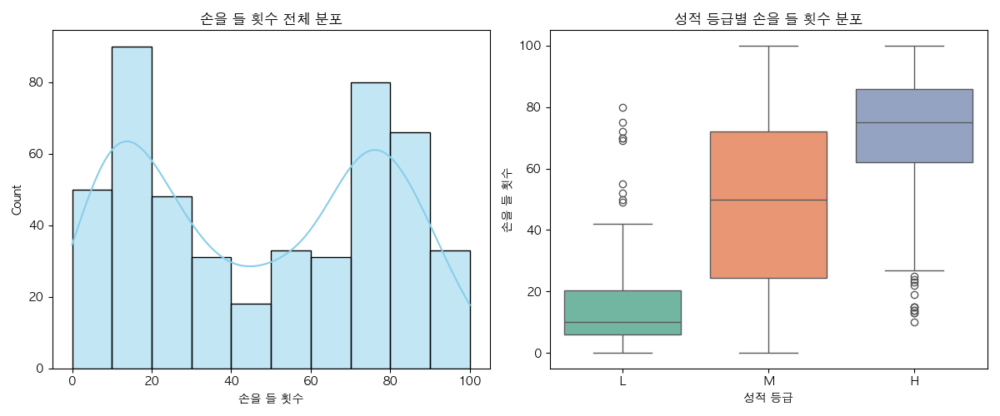

- **분석**: H등급(초록색) 학생들은 70~100회 가까이 손을 듭니다. 반면 L등급(주황색) 학생들은 20회 미만에 머물러 있습니다. 성적과 매우 강한 양의 상관관계가 있습니다.

### 2.2 과목 공지 확인 횟수 (VisITedResources)

> **온라인 학습 리소스를 얼마나 자주 확인했는지 보여줍니다.** > 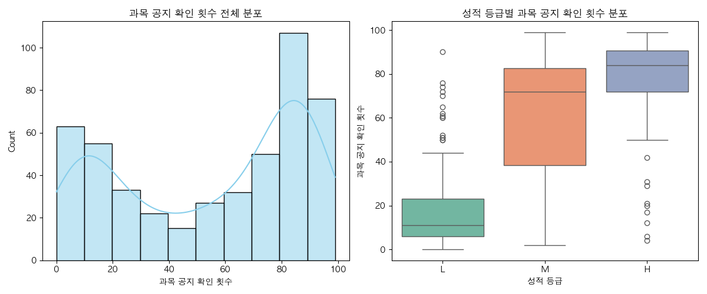

- **분석**: H등급 학생들의 중앙값은 약 80회 이상입니다. 공부를 잘하는 학생일수록 자료를 자주 확인한다는 상식이 통하는 그래프입니다.

### 2.3 공지사항 조회 횟수 (AnnouncementsView)

> **선생님의 공지사항을 얼마나 챙겨보는지 나타냅니다.** > 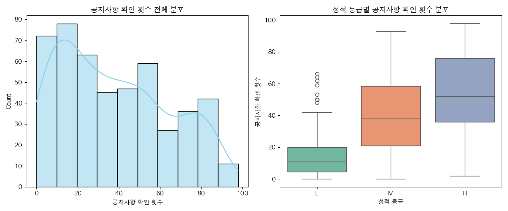

- **분석**: 역시 성적이 높을수록 조회수가 높습니다. 단, M(중위권)과 H(상위권)의 분포가 일부 겹치는 구간이 있어 변별력은 위 두 변수보다는 약간 낮을 수 있습니다.

### 2.4 토론 참여 횟수 (Discussion)

> **토론 그룹에 참여한 횟수입니다.** > 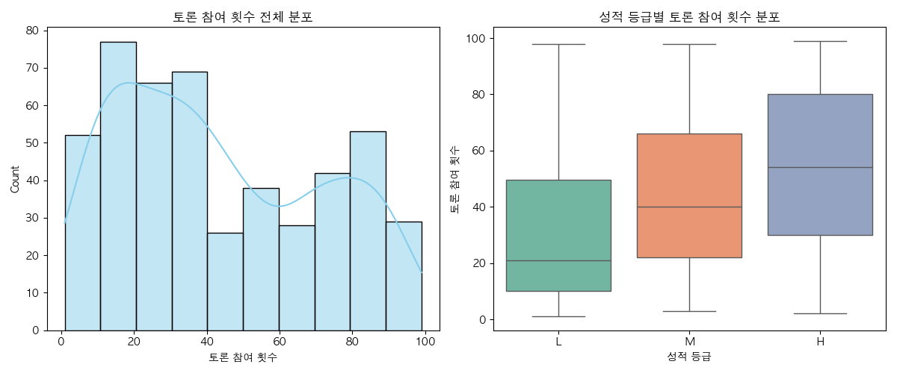

- **분석**: 전반적으로 우상향 하지만, **L등급(부진)** 학생들 중에서도 토론에 매우 활발히 참여하는 '이상치(Outlier)' 점들이 보입니다. (말만 많이 하고 성적은 안 나오는 유형일 수 있습니다.)

---

## 3. 범주형 변수 분석 (환경 및 특성)

오른쪽 그래프(Stacked Bar Chart)에서 **성적 등급의 비율 변화**를 중점적으로 보세요.

### [3-1] 성적에 결정적인 영향을 미치는 핵심 변수들

### 3.1.1 결석 횟수 (StudentAbsenceDays) - ★★★ 중요

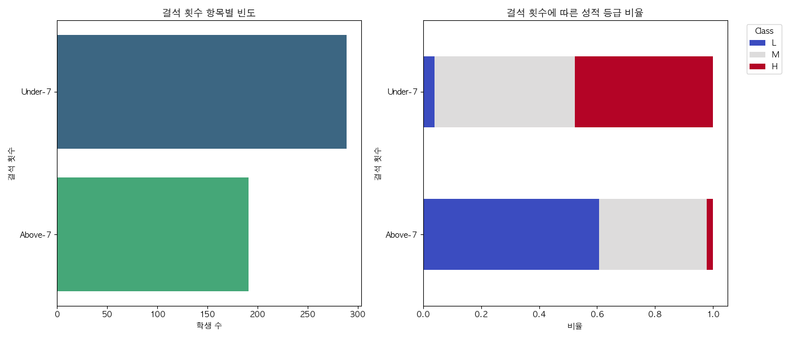

- **분석**: 이 데이터셋에서 가장 중요한 변수입니다.
  - **Under-7 (7일 미만)**: 빨간색(L등급)이 거의 없고 대부분 M, H등급입니다.
  - **Above-7 (7일 이상)**: **거의 절반 가까운 학생이 L등급(성적 부진)으로 추락**합니다.
  - **결론**: 성적 관리의 제1원칙은 '출석'입니다.

### 3.1.2 보호자 관계 (Relation)

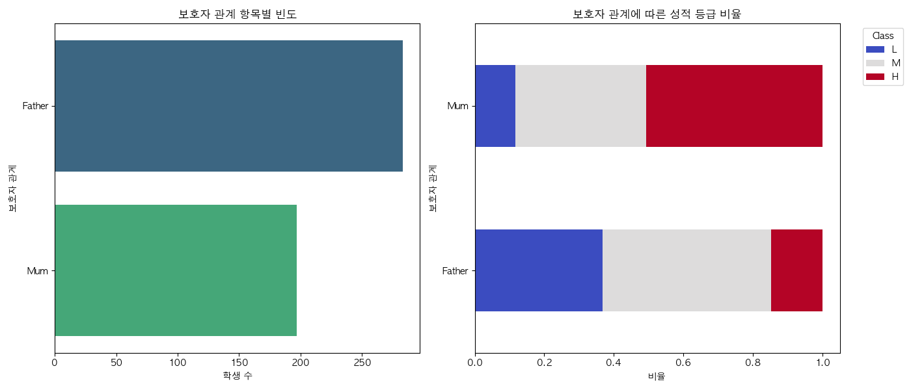

- **분석**: 주 보호자가 **엄마(Mum)**인 경우 H등급(파란색) 비율이 눈에 띄게 높습니다. 아빠(Father)가 보호자인 경우 상대적으로 L/M 등급 비율이 높습니다. 가정 내 학습 지도는 엄마가 주도할 때 효과가 컸습니다.

### 3.1.3 부모 설문 참여 (ParentAnsweringSurvey)

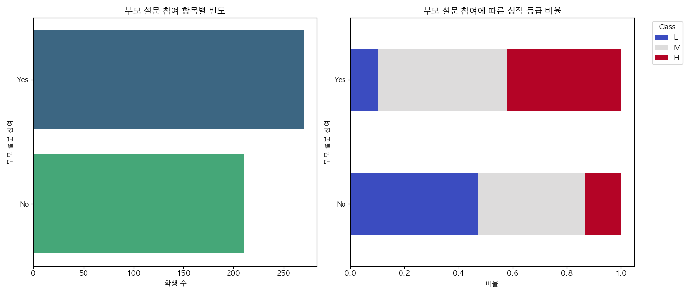

- **분석**: 학교 설문에 'Yes'라고 답한 적극적인 부모의 자녀가 성적이 훨씬 좋습니다. 'No'인 그룹은 L등급 비율이 상당히 높습니다.

### 3.1.4 부모 학교 만족도 (ParentschoolSatisfaction)

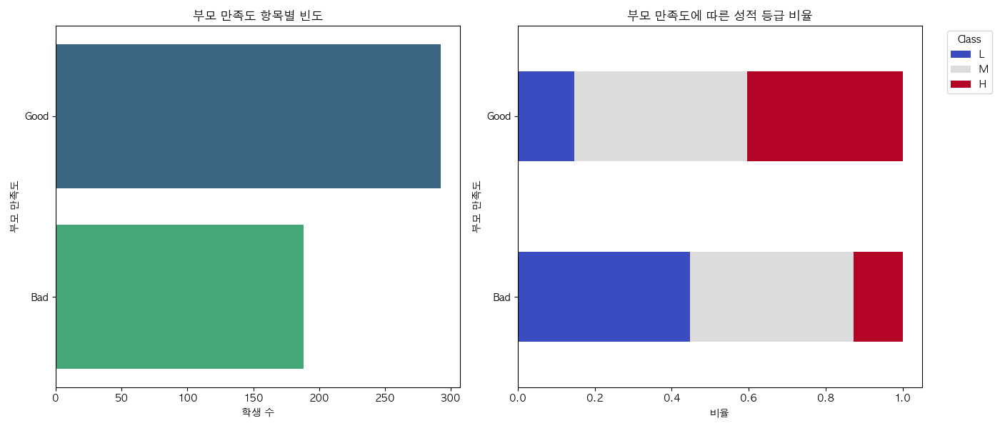

- **분석**: 학교에 만족하는(Good) 부모의 자녀들이 성적도 좋습니다. (자녀 성적이 좋아서 만족도가 높은 것인지, 만족도가 높아서 성적이 좋은 것인지는 인과관계의 영역입니다)

---

### [3-2] 인구통계학적 특성

### 3.2.1 성별 (gender)

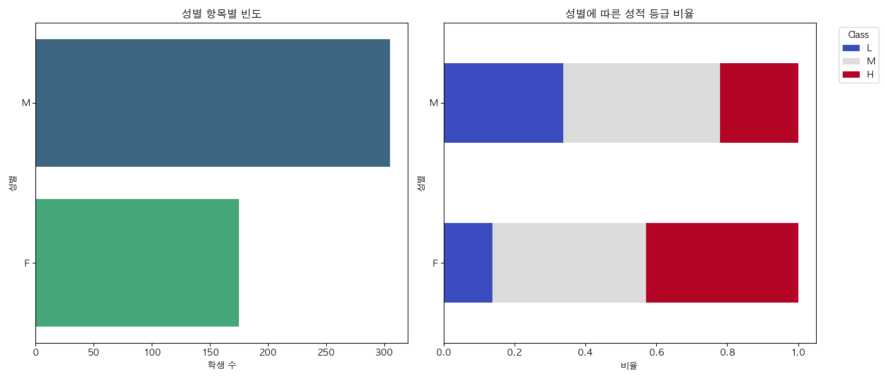

- **분석**: 여학생(F) 그룹에서 H등급 비율이 남학생(M)보다 더 높습니다. 남학생 그룹에는 L등급(성적 부진) 비율이 꽤 있습니다.

### 3.2.2 국적 (NationalITy)

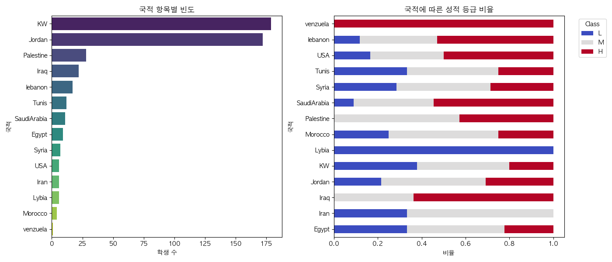

- **분석**: KW(쿠웨이트)와 Jordan(요르단) 학생이 다수입니다. Iraq나 Palestine 학생들의 성적 분포가 상대적으로 좋아 보이지만 샘플 수가 적어 일반화하긴 어렵습니다.

### 3.2.3 출생지 (PlaceofBirth)

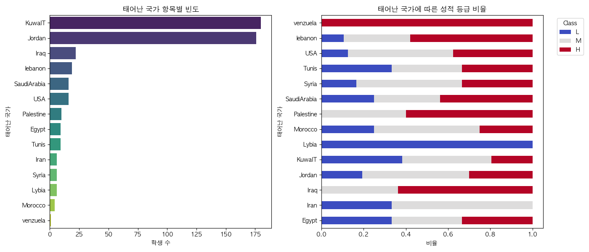

- **분석**: 국적 데이터와 거의 유사한 패턴을 보입니다.

---

### [3-3] 학교 생활 및 커리큘럼

### 3.3.1 학년 (GradeID)

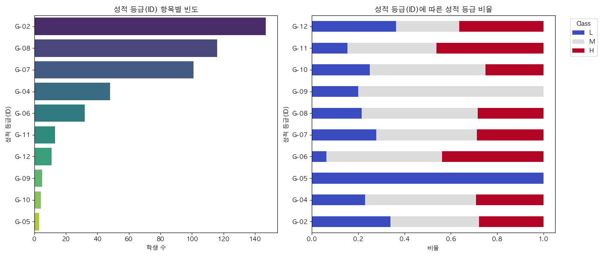

- **분석**: 저학년(G-02)일수록 성적이 좋은 비율이 높고, 고학년으로 갈수록 성적 분포가 다양해집니다.

### 3.3.2 학교 단계 (StageID)

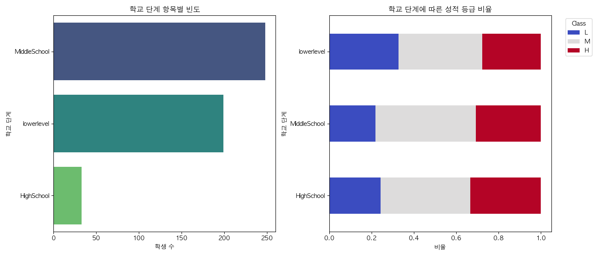

- **분석**: 초(lowerlevel) - 중(MiddleSchool) - 고(HighSchool) 단계입니다. 중학교 단계 학생이 가장 많으며, 단계별 성적 비율 차이는 크지 않습니다.

### 3.3.3 반 이름 (SectionID)

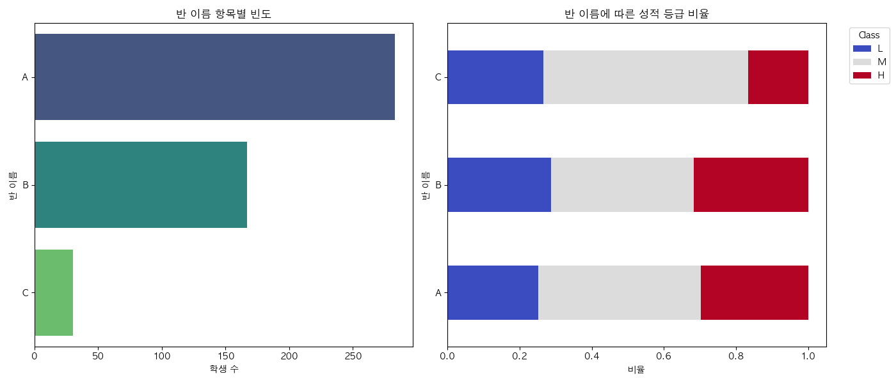

- **분석**: A반, B반, C반의 성적 분포는 비슷합니다. 이는 우열반 편성이 아니라 무작위 배정임을 시사합니다.

### 3.3.4 과목 (Topic)

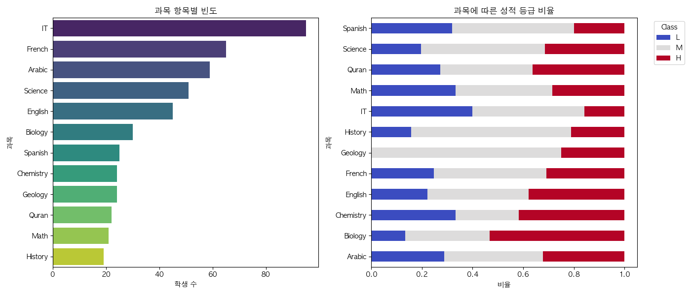

- **분석**: IT 과목 수강생이 가장 많지만 L등급 비율도 꽤 높습니다. 반면 Biology(생물), Geology(지질학) 수강생들은 전반적으로 성적이 좋은 편입니다.

### 3.3.5 학기 (Semester)

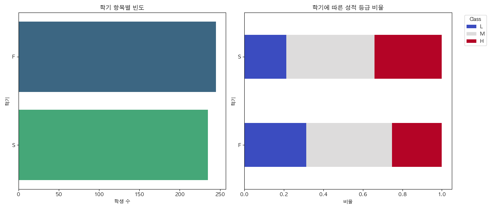

- **분석**: 1학기(F)보다 **2학기(S)**에 H등급 비율이 늘어납니다. 학생들이 학교에 적응하면서 성취도가 향상되는 경향이 있습니다.

---

## 4. 모델 학습 결과 평가

위 변수들을 모두 사용하여 XGBoost 모델을 학습시킨 결과입니다.

### 4.1 혼동 행렬 (Confusion Matrix)

> "모델이 실제로 어떻게 맞추고 틀렸는가?"
> 

- **L (부진)**: 실제 25명 중 23명을 정확히 맞힘 (매우 정확함)
- **M (보통)**: 실제 42명 중 32명을 맞힘 (일부는 H나 L로 오분류)
- **H (우수)**: 실제 29명 중 19명을 맞힘 (경계선에 있는 학생 예측이 어려움)

### 4.2 ROC 곡선 (ROC Curve)

> "모델의 변별력은 얼마나 좋은가?"
> 

- AUC 점수가 1에 가까울수록 완벽한 모델입니다.
- **L 등급(0.97)**은 모델이 아주 쉽게 구분해냅니다.
- H와 M 등급도 0.89, 0.91로 매우 훌륭한 예측 성능을 보입니다.

---

## 5. 결론: 가장 중요한 요소는? (Feature Importance)

데이터 분석 결과를 종합하면, 성적 향상을 위한 핵심 전략은 다음과 같습니다.

1.  **출석 관리 (결석 7일 미만 유지)**: 가장 압도적인 영향력을 가집니다.
2.  **적극적인 수업 태도**: 수업 자원 확인(`VisITedResources`)과 손들기(`raisedhands`)를 많이 할수록 성적이 오릅니다.
3.  **가정의 관심**: 보호자(`Relation`)가 엄마이거나, 학교 설문(`ParentAnsweringSurvey`)에 참여하는 가정의 학생이 성적이 좋습니다.

---

## 6. 종합 제언: 데이터로 본 성적 향상 전략

**"성적은 머리가 아니라 '성실함'과 '관심'의 결과입니다."**

본 분석은 학생의 성적이 지능이나 국적보다는 **학교 생활의 태도**와 **가정의 환경**에 의해 결정된다는 사실을 명확히 보여줍니다. 따라서 다음과 같은 구체적인 행동 전략을 제안합니다.

### 1. 골든타임은 '결석 7일'입니다. (Risk Management)

데이터상으로 **결석이 7일을 넘어가는 순간(Above-7)**, 성적 부진(L등급)으로 떨어질 확률이 급격히 증가합니다.

- **Action Plan**: 결석이 3~4일에 도달했을 때부터 학교와 가정에서 조기 경보를 울리고 집중 상담을 진행해야 합니다. 7일이라는 마지노선을 넘기지 않도록 관리하는 것이 최우선 과제입니다.

### 2. '손들기'와 '클릭'을 유도하세요. (Engagement)

수업 내용을 다 이해하지 못해도 괜찮습니다. 데이터는 **수업 자료를 클릭(`VisITedResources`)하고 손을 드는 행위(`raisedhands`) 자체**가 성적과 매우 강한 상관관계가 있음을 증명합니다.

- **Action Plan**: 성적이 낮은 학생들에게 무조건적인 성적 향상을 요구하기보다, "하루에 한 번 질문하기", "온라인 공지 매일 확인하기"와 같은 **작고 구체적인 행동 목표**를 부여하여 학습 참여도를 높여야 합니다.

### 3. '엄마'를 교육의 파트너로 만드세요. (Parental Involvement)

주 보호자가 어머니(`Mum`)이고, 학교 설문에 적극적일수록 학생의 성취도가 높았습니다. 이는 가정 내의 세심한 정서적, 학습적 지원이 중요하다는 방증입니다.

- **Action Plan**: 학교는 학부모(특히 어머니)가 교육 활동에 관심을 가질 수 있도록 소통 채널을 강화하고, 설문조사나 상담 참여를 독려하는 것이 학생의 성적 향상을 돕는 우회적이지만 강력한 방법입니다.
