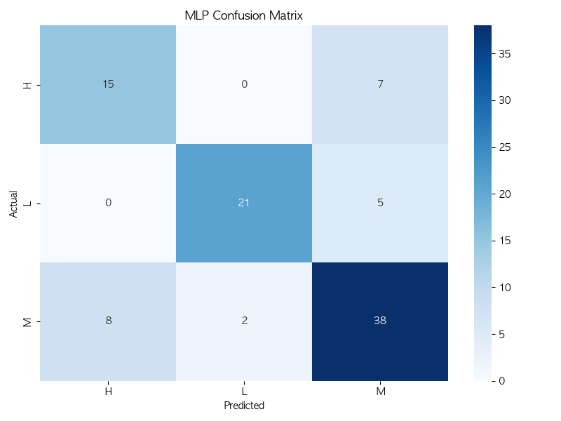
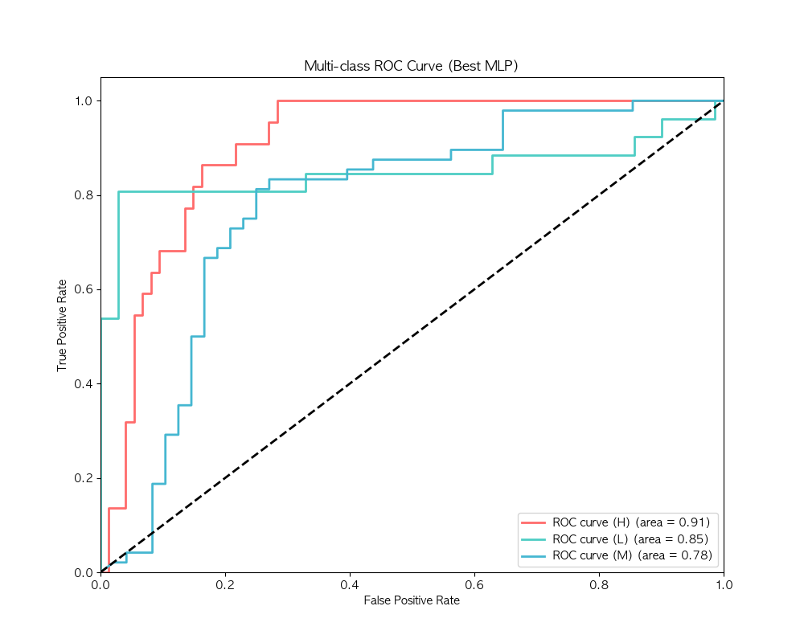
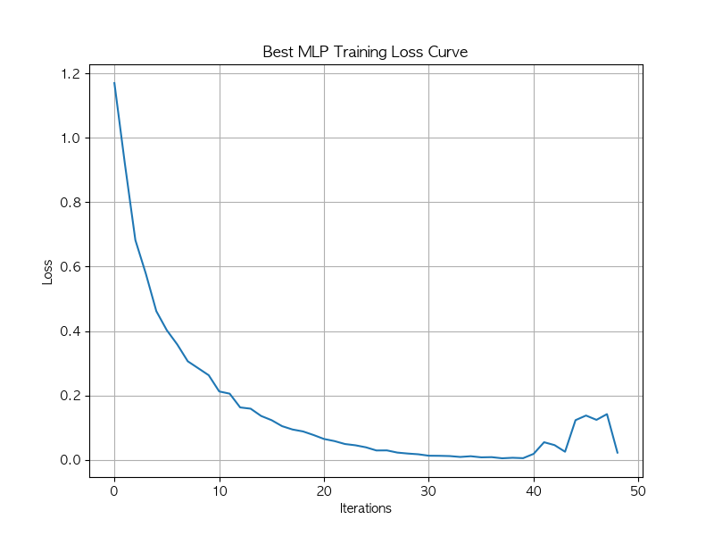

# 학생 성적 분석 보고서 (MLP)

## 1. 개요

본 보고서는 **xAPI-Edu-Data** 데이터셋을 활용하여 다층 퍼셉트론(MLP) 분류기로 학생들의 학업 성취도(`Class`)를 예측한 분석 결과를 제시합니다. 타겟 변수인 `Class`는 학생들의 성적을 **낮음(L)**, **보통(M)**, **높음(H)** 세 단계로 분류합니다.

## 2. 분석 방법

### 2.1 데이터 전처리

- **데이터 로드**: `xAPI-Edu-Data.csv` 파일에서 데이터를 로드했습니다.
- **특성 인코딩**:
  - 범주형 변수(성별, 국적, 태어난 곳, 학교 단계, 성적 등급, 반 이름, 과목, 학기, 보호자 관계, 설문 참여 여부, 학교 만족도, 결석 횟수)는 **원-핫 인코딩(One-Hot Encoding)**을 사용하여 변환했습니다.
  - 타겟 변수 `Class`는 다음과 같이 수치형으로 변환했습니다:
    - **H (높음) -> 0**
    - **L (낮음) -> 1**
    - **M (보통) -> 2**
- **데이터 분할**: 전체 데이터를 **학습용 80%**, **테스트용 20%**로 분리했습니다.
- **특성 스케일링**: 신경망 성능 최적화를 위해 **StandardScaler**를 사용하여 특성 값을 정규화했습니다.

### 2.2 모델 구조

- **모델**: `MLPClassifier` (Scikit-learn)
- **하이퍼파라미터 튜닝**: `GridSearchCV`를 사용하여 최적의 파라미터 탐색 (5-Fold 교차 검증)
- **최적 파라미터**:
  - **은닉층 (Hidden Layers)**: (128, 64, 32)
  - **학습률 (Learning Rate)**: 0.01
  - **규제 (Alpha)**: 0.0001
  - **활성화 함수 (Activation)**: relu
- **최대 반복 횟수**: 1000회
- **난수 시드**: 42

## 3. 분석 결과

### 3.1 모델 성능

- **전체 정확도 (Accuracy)**: **77.08%**

### 3.2 분류 리포트 (Classification Report)

| 클래스       | 정밀도 (Precision) | 재현율 (Recall) | F1-점수 (F1-Score) | 데이터 수 (Support) |
| :----------- | :----------------- | :-------------- | :----------------- | :------------------ |
| **높음 (H)** | 0.65               | 0.68            | 0.67               | 22                  |
| **낮음 (L)** | 0.91               | 0.81            | 0.86               | 26                  |
| **보통 (M)** | 0.76               | 0.79            | 0.78               | 48                  |
| **평균**     | **0.78**           | **0.76**        | **0.77**           | **96**              |

### 3.3 혼동 행렬 (Confusion Matrix)

| 실제값 \ 예측값 | 높음 (H) | 낮음 (L) | 보통 (M) |
| :-------------- | :------: | :------: | :------: |
| **높음 (H)**    |  **15**  |    0     |    7     |
| **낮음 (L)**    |    0     |  **21**  |    5     |
| **보통 (M)**    |    8     |    2     |  **38**  |

## 4. 결과 시각화 (Result Visualization)

### 4.1 혼동 행렬 (Confusion Matrix)

### 4.2 ROC 곡선 (Multi-class ROC Curve)

### 4.3 학습 곡선 (Training Loss Curve)

## 5. 결론

MLP 모델은 하이퍼파라미터 튜닝을 통해 **77.08%**의 정확도를 유지했습니다.

- **튜닝 결과**: 은닉층을 더 깊게 (128, 64, 32) 구성하고 학습률을 0.01로 조정했을 때 최적의 성능을 보였습니다.
- **낮음(L) 클래스 성능 향상**: 튜닝 전 대비 낮음(L) 클래스의 정밀도가 0.80에서 **0.91**로 대폭 상승했습니다. 이는 학업 성취도가 낮은 학생을 매우 정확하게 식별해낸다는 것을 의미합니다.
- **높음(H) 클래스 성능 하락**: 반면 높음(H) 클래스의 정밀도는 다소 하락(0.74 -> 0.65)하여, 튜닝 과정에서 모델이 L 클래스 식별에 더 최적화되었음을 시사합니다.
- 대부분의 오분류는 **보통(M)** 클래스와 다른 두 클래스 사이에서 발생했습니다. 이는 '보통'이 중간 단계이기 때문에 발생하는 자연스러운 현상으로 보입니다. '높음'과 '낮음' 클래스 간의 혼동은 전혀 없었습니다(혼동 행렬에서 0건).

## 6. 향후 계획

성능을 추가로 향상시키기 위한 제안:

- **앙상블 모델 도입**: XGBoost, LightGBM, Random Forest와 같은 트리 기반 앙상블 모델을 적용하여 MLP 모델과 성능을 비교 분석합니다.
- **특성 공학 (Feature Engineering)**: 중요도가 낮은 변수를 제거하거나 새로운 파생 변수를 생성하여 모델의 복잡도를 줄이고 일반화 성능을 높입니다.
- **데이터 증강 (Data Augmentation)**: 클래스 불균형 문제를 완화하기 위해 SMOTE와 같은 오버샘플링 기법을 적용해 봅니다.
