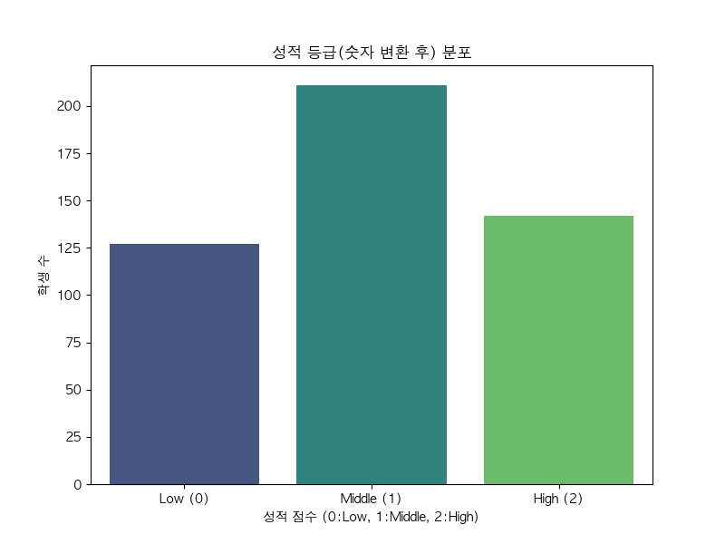
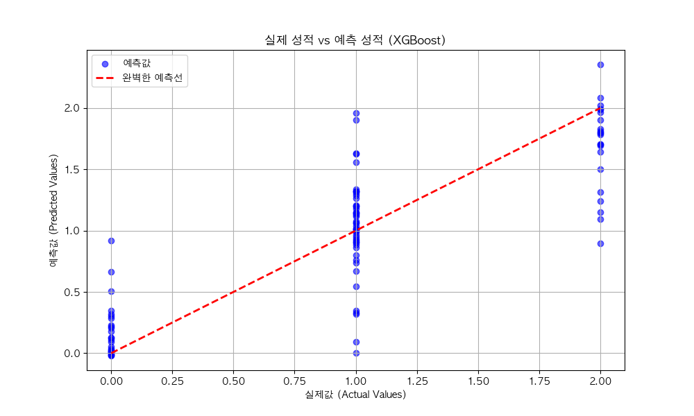
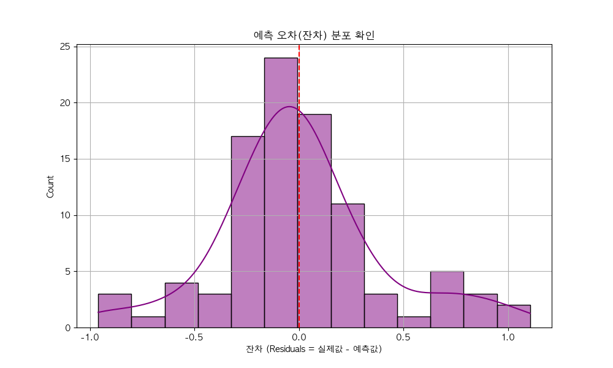
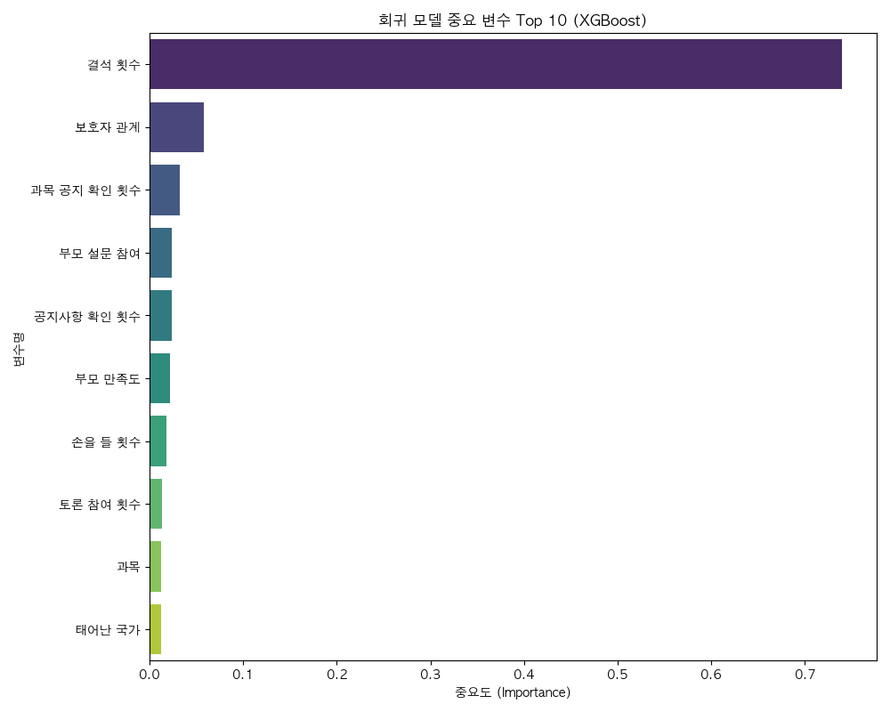

# 📊 초보자를 위한 학생 성적 예측 분석 보고서 (회귀 분석)

## 1. 분석의 목적

우리는 **"학생들의 평소 활동 데이터를 보면 성적을 예측할 수 있을까?"** 라는 궁금증을 해결하기 위해 인공지능(AI)을 사용했습니다.

기존에는 성적을 단순히 A반, B반처럼 그룹으로 나누는 **'분류'** 방식을 사용했지만, 이번에는 **'점수'** 로 생각하여 더 정밀하게 예측하는 **'회귀(Regression)'** 방식을 사용했습니다.

- **성적 등급을 점수로 변환**:
  - `L` (Low, 하위권) ➔ **0점**
  - `M` (Middle, 중위권) ➔ **1점**
  - `H` (High, 상위권) ➔ **2점**

---

## 2. 우리가 가진 데이터 살펴보기

먼저 분석할 학생들의 성적 분포를 살펴봅시다.

- 위 그래프는 학생들의 성적이 `Low(0)`, `Middle(1)`, `High(2)`로 어떻게 퍼져 있는지 보여줍니다.
- 이 데이터를 AI에게 공부시켜서, 새로운 학생의 패턴만 보고도 점수를 맞출 수 있게 합니다.

---

## 3. 사용한 인공지능 모델 (AI 선생님) 설명

성적을 예측하기 위해 두 명의 AI 선생님(모델)을 모셨습니다.

1.  **선형 회귀 (Linear Regression) 선생님** 📏

    - **스타일**: "공부를 많이 하면 성적이 비례해서 오른다!"라고 생각하는 단순하고 명쾌한 선생님입니다.
    - 데이터의 관계를 **직선**으로 설명하려고 합니다.

2.  **XGBoost 선생님** 🌳
    - **스타일**: "질문을 계속 던져서 정답을 찾아보자!" (수업은 잘 들었니? ➔ 예 ➔ 그럼 과제는 했니? ...)
    - 스무고개 같은 **질문 트리**를 수백 개 만들어서 종합적으로 판단하는 아주 똑똑하고 복잡한 선생님입니다.

---

## 4. 성적표: AI는 얼마나 잘 맞췄을까요?

AI가 예측한 점수와 실제 학생 점수를 비교해서 채점을 해봤습니다.
가장 중요한 점수는 **결정 계수 (R2 Score)** 입니다. 이는 AI가 성적의 변화를 얼마나 잘 설명하는지 나타내는 점수로, **100점에 가까울수록 완벽**하다는 뜻입니다.

| 모델 (AI 선생님) | 점수 (R2 Score)    | 해석                                           |
| :--------------- | :----------------- | :--------------------------------------------- |
| **선형 회귀**    | **약 0.71 (71점)** | 학생 성적의 71% 정도를 설명할 수 있습니다.     |
| **XGBoost**      | **약 0.70 (70점)** | 선형 회귀와 비슷하게 준수한 성능을 보였습니다. |

> **결론**: 두 모델 모두 70점대로 꽤 훌륭하게 성적을 예측하고 있습니다. 의외로 단순한 방식인 '선형 회귀'가 이번 데이터에서는 아주 조금 더 잘 맞췄네요!

---

## 5. 눈으로 확인하는 분석 결과

### (1) 실제 성적 vs 예측 성적 비교

AI가 예측한 점수(세로축)와 실제 학생 점수(가로축)가 얼마나 일치하는지 봅니다.

> **"왜 점들이 빨간 선 위에 딱 붙어있지 않고 퍼져 있나요?"**
> 날카로운 지적입니다! 이 그래프에는 몇 가지 비밀이 있습니다.
>
> 1.  **가로축(실제값)의 비밀**: 실제 성적은 **0점(L), 1점(M), 2점(H)** 딱 세 가지 정수밖에 없습니다. 그래서 점들이 가로로 퍼지지 않고 0, 1, 2 위치에 기둥처럼 서 있는 것입니다.
> 2.  **세로축(예측값)의 비밀**: 반면 AI(회귀 모델)는 "이 학생은 0.8점 정도 될 것 같아", "이 학생은 1.9점이야" 처럼 **소수점 단위로 예측**합니다. 그래서 세로축으로는 점들이 위아래로 넓게 퍼져 있습니다.
> 3.  **빨간 선(정답선)과의 거리**:
>     - 빨간 점선은 **완벽한 정답(실제값=예측값)** 을 의미합니다.
>     - 점들이 빨간 선 위에 정확히 있지 않은 이유는 AI가 "정확히 1점!"이라고 맞추기보다 **"1점에 가까운 0.9점"** 또는 **"1.2점"** 으로 예측했기 때문입니다.
>     - **파란 점들(예측값)** 의 중심이 **빨간 선**을 따라 우상향(↗)하고 있다면, AI가 전체적인 성적의 높낮이는 잘 맞추고 있다는 뜻입니다. 비록 정확히 선 위에 있지 않더라도 비슷한 위치에 모여 있다면 훌륭한 예측입니다.

### (2) 틀렸다면 얼마나 틀렸을까? (오차 분포)

예측값이 실제값과 얼마나 차이가 났는지(잔차)를 보여줍니다.

- 그래프가 **0(가운데)** 에 높게 솟아 있을수록, 오차가 거의 없다는 뜻입니다.
- 대부분의 예측이 0 근처에 몰려 있어, 큰 실수 없이 안정적으로 예측하고 있습니다.

### (3) 성적에 가장 큰 영향을 준 요인은? (중요도)

"성적을 올리려면 무엇을 해야 할까요?"에 대한 대답입니다.

- 그래프의 막대가 길수록 성적을 결정짓는 데 중요한 역할을 합니다.
- **VisITedResources (자료 조회수)**, **StudentAbsenceDays (결석 일수)** 등이 상위권에 있다면, **"수업 자료를 많이 보고 결석을 하지 않는 것"** 이 성적 향상의 지름길임을 데이터가 증명해주고 있습니다.

---

## 6. 최종 요약

1.  학생들의 활동 데이터로 성적을 **약 71%의 정확도**로 예측할 수 있었습니다.
2.  복잡한 모델보다 단순한 **선형 모델**이 이 데이터에는 더 잘 맞았습니다.
3.  성적을 잘 받으려면 **수업 자료 확인**과 **출석 관리**가 중요하다는 것을 알 수 있었습니다.

이 분석을 통해 선생님들은 어떤 학생이 성적이 떨어질 위험이 있는지 미리 파악하고 도와줄 수 있을 것입니다.
